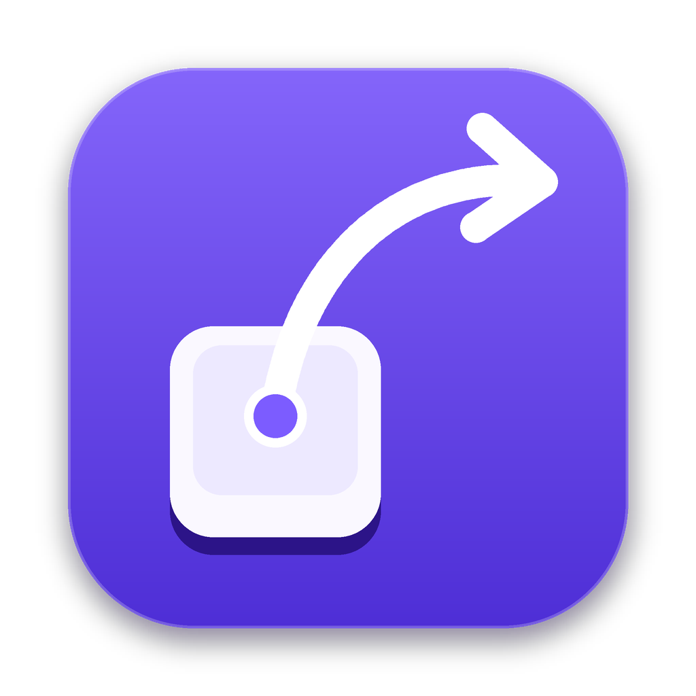

<p align="center">
  
</p>

<h1 align="center">Leap</h1>

<p align="center">
  A leader-key launcher for macOS: press one key, then a short sequence.<br>
  <b>C++20 · Qt 6 / QML · CGEventTap · Accessibility API · Objective-C++</b>
</p>

<!-- demo: add resources/demo.gif and uncomment
<p align="center">
  
</p>
-->

---

Global shortcuts run out fast: every app already owns ⌘⌥⇧-whatever, and nobody remembers twenty four-key chords. Leap uses one **leader key** instead. Press it, and a hint panel shows what each next key does:

```
Caps Lock → T          open Telegram
Caps Lock → W → H      window to the left half
Caps Lock → O → D      open ~/Downloads
Caps Lock → ; → U U U  volume up, three times
```

Keys are short, mnemonic and nested in groups, so you can bind dozens of actions without a single chord — and you never have to memorise them: the panel is right there.

## What it does

- **Leader key of your choice.** Caps Lock, a tap of right ⌘ or right ⌥ (they still work in shortcuts), or ⌥Space.
- **Hints when you need them.** The panel appears after a short delay, so muscle memory never sees it. A wrong key shakes it; ⌫ goes back a level, Esc closes.
- **Works in any keyboard layout.** Bindings are physical keys, not characters: with the Russian layout on, the key labelled Е still triggers T.
- **Actions:** open or focus an app, open a file, folder or URL, run a shell command, paste a text snippet, move the front window (halves, thirds, quarters, center, next display, with an optional gap), and system actions (volume, mute, dark mode, display sleep, lock screen).
- **Sticky groups** stay open after an action, for things you repeat: volume, window moves.
- **Never takes focus.** The panel is a click-through, non-activating panel on every Space, above full-screen apps.
- **Settings UI** with a tree editor, Finder icons, previews of window layouts, conflict highlighting — plus a plain JSON config you can edit by hand or keep in your dotfiles. Leap reloads it on change.

## How it works

```
CGEventTap (every key event)  ──►  leap::Engine  ──►  swallow? yes/no   (synchronously, inside the tap)
                                        │
                                        └──► effect (queued to the main loop)
                                               ├── overlay: show / update / shake / hide
                                               └── action: NSWorkspace, AX, AppleScript, zsh …
```

- **`src/core`** — plain C++20, no Qt, no OS calls, unit-tested:
  - `Engine` decides for every key event whether it starts or continues a sequence and must be swallowed. It detects the leader (a chord, Caps Lock, or a *tap* of a modifier: pressed and released alone within 400 ms, not used in ⌘C), swallows the matching key-ups, lets ⌘/⌃ shortcuts through and cancels, ignores auto-repeat except in sticky groups.
  - `Sequencer` walks the key tree; `Keymap` holds it and finds duplicate keys.
  - `Keys` maps macOS virtual keycodes to names and Cyrillic input to physical keys.
  - `Layout` computes window frames on a display (with gaps) and moves windows between displays.
  - `HidMapping` parses and builds `hidutil` key mappings.
- **`src/platform/Native_mac.mm`** — the event tap (re-enabled when macOS times it out; Leap's own synthetic ⌘V is tagged and skipped), the non-activating panel, window moves through the Accessibility API (with `AXEnhancedUserInterface` switched off during the move to avoid animated resizes), Finder icons, login item.
- **Caps Lock** can't be swallowed by an event tap — the lock state toggles below it. Leap asks the HID driver to report it as F18 (`hidutil property --set …UserKeyMapping…`), merging with any mappings you already have, and restores it on quit.
- **`src/app`** — the Qt side: `Controller` (engine ↔ overlay ↔ actions, settings backend), JSON config with a file watcher, tray menu, image provider for Finder icons. **`qml/`** — the hint panel and the settings window, all icons drawn as vector paths.

## Building

```bash
brew install qt cmake ninja
cmake -S . -B build -G Ninja -DCMAKE_PREFIX_PATH="$(brew --prefix qt)"
cmake --build build
ctest --test-dir build          # core tests
open build/Leap.app
```

Or open the folder in CLion. To build a self-contained, ad-hoc signed `Leap.app` and `.dmg` and install it:

```bash
./scripts/package.sh --install
```

On first launch Leap asks for **Accessibility** access (System Settings → Privacy & Security → Accessibility) — that's what lets it see key presses. It picks the permission up without a restart.

> Every rebuild gets a new ad-hoc signature, and macOS ties the permission to it. If keys stop working after a rebuild, remove Leap from the Accessibility list and add it again.

## Notes

- If you switch input sources with Caps Lock, pick right ⌘ as the leader: with Caps Lock as the leader, Caps Lock no longer switches layouts while Leap runs.
- Secure input (password fields, Terminal's *Secure Keyboard Entry*) hides keys from all event taps, Leap included.
- The dark mode action asks once for permission to control System Events.
- Config: `~/Library/Application Support/Leap/config.json`.

## License

MIT
